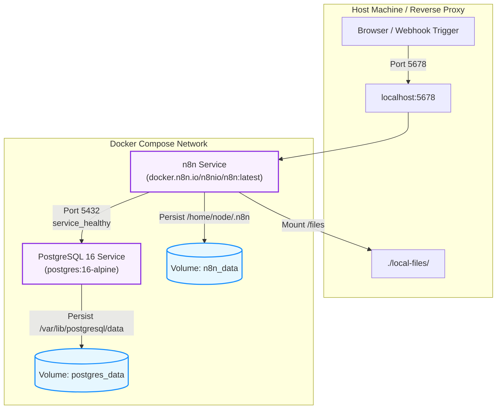

# n8n — Production-Ready Self-Hosted Docker Setup

[-EA4B71?logo=n8n&logoColor=white)](https://n8n.io)
[](https://www.postgresql.org/)
[](https://docs.docker.com/compose/)
[](LICENSE)
[](https://github.com)

A robust, hardened, self-hosted deployment of [n8n](https://n8n.io) workflow automation powered by Docker Compose and PostgreSQL 16. Configured out of the box with execution history pruning, strict runner sandboxing, healthchecked database startup ordering, and local file storage mounting.

---

## Architecture & Data Flow



---

## Key Highlights & Design Decisions

- **PostgreSQL over SQLite**: SQLite is n8n's lightweight default, but takes a write lock on every single execution. Postgres unlocks non-blocking concurrent workflow executions and zero database lock timeouts.
- **Ordered Bootstrapping**: n8n waits for Postgres via `condition: service_healthy` backed by `pg_isready`. No race conditions or boot loop migrations.
- **Automated Pruning**: Execution history is automatically pruned after 14 days (`EXECUTIONS_DATA_MAX_AGE=336`), preventing runaway disk consumption.
- **Container Sandboxing**: Telemetry is disabled (`N8N_DIAGNOSTICS_ENABLED=false`), and Code nodes are blocked from inspecting container host environment variables (`N8N_BLOCK_ENV_ACCESS_IN_NODE=true`).
- **Local File Interop**: `./local-files` is mounted into the container at `/files` for convenient Read/Write Binary File operations.

---

## Quick Start

### 1. Prerequisites
- [Docker Engine](https://docs.docker.com/engine/install/) (v24.0+) & [Docker Compose](https://docs.docker.com/compose/) (v2.20+)
- Git

### 2. Clone and Setup Environment

```bash
git clone git@github.com:ajaymahato431/n8n.git
cd n8n
cp .env.example .env
```

*(On Windows PowerShell: `Copy-Item .env.example .env`)*

### 3. Generate Encryption Key & Set Credentials

Generate a secure 32-byte encryption key:
- **Linux/macOS:**
  ```bash
  openssl rand -hex 32
  ```
- **Windows PowerShell:**
  ```powershell
  -join ((1..32) | ForEach-Object { '{0:x2}' -f (Get-Random -Max 256) })
  ```

Open `.env` and configure:
1. `N8N_ENCRYPTION_KEY`: Paste the generated 32-character key.
2. `POSTGRES_PASSWORD`: Choose a strong database password.
3. `GENERIC_TIMEZONE`: Set your local timezone (e.g. `UTC`, `America/New_York`, `Asia/Kathmandu`).

> [!IMPORTANT]
> **Keep your `N8N_ENCRYPTION_KEY` safe and backed up!** n8n uses this key to encrypt all saved credentials in Postgres. If lost, your credentials cannot be recovered and must be re-entered. Never alter this key on an existing instance.

### 4. Launch the Stack

```bash
docker compose up -d
```

Check running container status:
```bash
docker compose ps
```

Open your browser at **http://localhost:5678** and complete the initial owner account registration.

---

## Configuration Reference (`.env`)

| Variable | Default | Purpose & Notes |
|---|---|---|
| `N8N_PORT` | `5678` | Host port mapped to n8n container. |
| `N8N_HOST` | `localhost` | Hostname n8n resolves itself under. |
| `N8N_PROTOCOL` | `http` | Use `https` if SSL is terminated at a reverse proxy. |
| `N8N_WEBHOOK_URL` | `http://localhost:5678/` | Public URL used when generating webhook callback URLs. |
| `GENERIC_TIMEZONE` | `UTC` | Timezone governing Schedule and Cron triggers. |
| `N8N_ENCRYPTION_KEY` | *(Required)* | 32-character secret used to encrypt stored credentials. |
| `POSTGRES_USER` | `n8n` | Database username. |
| `POSTGRES_PASSWORD` | *(Required)* | Database password. |
| `POSTGRES_DB` | `n8n` | Database name. |
| `N8N_SECURE_COOKIE` | `false` | Set to `true` when serving behind an HTTPS reverse proxy. |
| `N8N_BLOCK_ENV_ACCESS_IN_NODE`| `true` | Prevents Code nodes from reading environment variables. |
| `EXECUTIONS_DATA_PRUNE` | `true` | Enables automatic pruning of past execution logs. |
| `EXECUTIONS_DATA_MAX_AGE` | `336` | Retention duration in hours (336h = 14 days). |
| `N8N_DIAGNOSTICS_ENABLED` | `false` | Disables sending telemetry to n8n.io. |
| `N8N_COMMUNITY_PACKAGES_ENABLED`| `true` | Enables UI installation of community nodes. |

---

## Common Management Commands

```bash
# View real-time application logs
docker compose logs -f n8n

# View database logs
docker compose logs -f postgres

# Restart services after updating .env
docker compose up -d

# Stop the stack (data is fully preserved in named volumes)
docker compose down
```

---

## Upgrades, Backups & Maintenance

### Upgrading n8n
n8n migrations run automatically on startup:
```bash
docker compose pull
docker compose up -d
```

### Database Backup
Workflows, execution histories, and encrypted credentials reside in PostgreSQL:
```bash
# Export database dump
docker compose exec postgres pg_dump -U n8n n8n > backup.sql
```
*(On Windows PowerShell: `docker compose exec postgres pg_dump -U n8n n8n | Out-File -Encoding utf8 backup.sql`)*

### Database Restore
Restore into a fresh PostgreSQL container:
```bash
# Linux/macOS
cat backup.sql | docker compose exec -T postgres psql -U n8n -d n8n

# Windows PowerShell
Get-Content backup.sql | docker compose exec -T postgres psql -U n8n -d n8n
```

> [!NOTE]
> A complete backup consists of `backup.sql` **and** your `.env` file containing the `N8N_ENCRYPTION_KEY`.

---

## Production & Reverse Proxy Deployment

When exposing n8n to the public internet:
1. Put a reverse proxy (e.g., Nginx, Caddy, Cloudflare, Traefik) in front with a valid TLS certificate.
2. In `.env`, set:
   ```env
   N8N_PROTOCOL=https
   N8N_HOST=n8n.yourdomain.com
   N8N_WEBHOOK_URL=https://n8n.yourdomain.com/
   N8N_SECURE_COOKIE=true
   ```
3. Forward `Host` and websocket upgrade headers:
   - `Upgrade: $http_upgrade`
   - `Connection: "Upgrade"`

---

## Troubleshooting

- **Port 5678 already bound**: Change `N8N_PORT=5679` in `.env` and run `docker compose up -d`.
- **Database connection error**: Verify `POSTGRES_PASSWORD` in `.env` matches between both containers and run `docker compose logs postgres`.
- **External webhooks fail**: External services cannot reach `localhost`. Configure `N8N_WEBHOOK_URL` with your public tunnel (e.g. ngrok, Cloudflare Tunnel) or domain.

---

## License

This project is licensed under the [MIT License](LICENSE).
